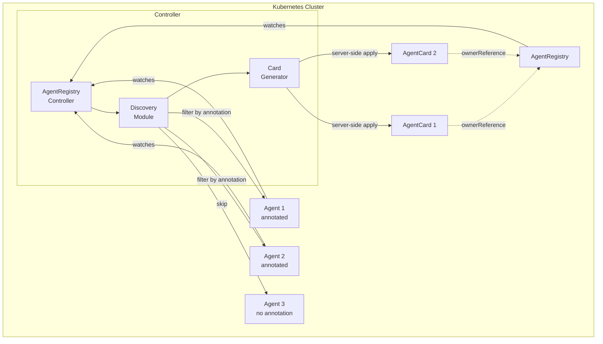
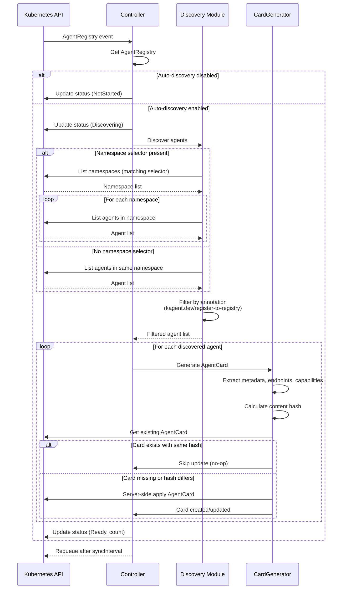

# Agent Registry Developer Guide

## Architecture

The Agent Registry is a Kubernetes-native solution for automatic agent discovery and cataloging. It consists of three main components:

1. **AgentRegistry CRD**: Configuration resource for discovery settings
2. **AgentCard CRD**: A2A-compliant agent metadata resource
3. **AgentRegistry Controller**: Reconciliation controller that discovers agents and generates cards

### Component Diagram



### Reconciliation Flow



## Code Organization

### CRD Definitions

```
go/api/v1alpha1/
├── agentregistry_types.go    # AgentRegistry spec & status
├── agentcard_types.go         # AgentCard spec & status
└── groupversion_info.go       # API group metadata
```

**Key Types:**
- `AgentRegistrySpec`: Discovery configuration, namespace selectors, sync interval
- `AgentRegistryStatus`: Phase, registered agent count, conditions
- `AgentCardSpec`: Agent identity, endpoints, capabilities, A2A version
- `AgentCardStatus`: Content hash, last seen, health, conditions

### Controller Logic

```
go/internal/controller/
├── agentregistry_controller.go       # Main reconciler
└── registry/
    ├── cardgen.go                    # AgentCard generation
    └── constants.go                  # Annotation keys and constants
```

**AgentRegistry Controller:**
- Watches `AgentRegistry`, `Agent`, and `Service` resources
- Implements annotation-based filtering
- Updates status with phase and registered agent count
- Manages requeue intervals based on `syncInterval`

**Card Generator:**
- Extracts agent metadata from spec and annotations
- Resolves endpoints (custom annotation → A2A config → Service DNS)
- Calculates SHA-256 hash for deduplication
- Uses server-side apply with field manager `kagent/agent-registry`

### Discovery Package

The discovery logic is embedded in the controller's `discoverAgents` and `filterAgentsByAnnotation` methods:

**Discovery Flow:**
1. Check if namespace selector is present
2. If yes: list namespaces matching selector, then list agents in each
3. If no: list agents in AgentRegistry's own namespace
4. Filter agents by `kagent.dev/register-to-registry: "true"` annotation
5. Exclude agents with `kagent.dev/discovery-disabled: "true"`

### Card Generation Package

Located in `go/internal/controller/registry/cardgen.go`:

**Functions:**
- `GenerateCard()`: Main entry point for card generation
- `extractVersion()`: Get version from labels or ResourceVersion
- `extractEndpoints()`: Resolve agent endpoints with fallback logic
- `extractCapabilities()`: Parse from annotation or A2A skills
- `extractMetadata()`: Collect metadata from annotations and spec
- `calculateHash()`: Generate SHA-256 hash of spec for deduplication
- `findServiceForAgent()`: Lookup Kubernetes Service for agent

**Endpoint Resolution Priority:**
1. Custom annotation (`kagent.dev/a2a-endpoint`)
2. A2A config (if declarative agent with A2A config)
3. Kubernetes Service (matching agent name)
4. None (if no endpoint can be resolved)

## Extending the Registry

### Adding Custom Discovery Sources

To add a new discovery source (e.g., discovering from Deployments with specific labels):

1. **Add watch to controller setup:**
```go
func (r *AgentRegistryController) SetupWithManager(mgr ctrl.Manager) error {
    return ctrl.NewControllerManagedBy(mgr).
        For(&v1alpha1.AgentRegistry{}).
        Watches(
            &appsv1.Deployment{},
            handler.EnqueueRequestsFromMapFunc(r.mapDeploymentToRegistry),
        ).
        Named("agentregistry").
        Complete(r)
}
```

2. **Implement mapping function:**
```go
func (r *AgentRegistryController) mapDeploymentToRegistry(ctx context.Context, obj client.Object) []reconcile.Request {
    // Return list of AgentRegistries to reconcile
}
```

3. **Add discovery logic in reconciler:**
```go
func (r *AgentRegistryController) discoverFromDeployments(ctx context.Context, registry *v1alpha1.AgentRegistry) ([]v1alpha2.Agent, error) {
    // Custom discovery logic
}
```

### Customizing A2A Fields

To add custom fields to the generated A2A card:

1. **Extend `AgentCardSpec`:**
```go
// In go/api/v1alpha1/agentcard_types.go
type AgentCardSpec struct {
    // ... existing fields
    
    // +optional
    CustomField string `json:"customField,omitempty"`
}
```

2. **Update card generator:**
```go
// In go/internal/controller/registry/cardgen.go
func (g *CardGenerator) GenerateCard(...) (*v1alpha1.AgentCard, error) {
    card := &v1alpha1.AgentCard{
        // ... existing fields
        Spec: v1alpha1.AgentCardSpec{
            CustomField: g.extractCustomField(agent),
        },
    }
}
```

3. **Regenerate CRDs:**
```bash
cd go
make manifests
```

### Adding New Annotations

To support a new annotation for discovery or metadata:

1. **Add constant in `constants.go`:**
```go
const (
    AnnotationMyFeature = "kagent.dev/my-feature"
)
```

2. **Use in discovery filter or card generation:**
```go
func (g *CardGenerator) extractMyFeature(agent *v1alpha2.Agent) string {
    if value, ok := agent.Annotations[AnnotationMyFeature]; ok {
        return value
    }
    return ""
}
```

3. **Document in user guide** (docs/registry/user-guide.md)

## Testing

### Running Unit Tests

Unit tests use the `fake.Client` from controller-runtime:

```bash
cd go
make test
```

**Test Coverage Goals:**
- Controller: >80%
- Card Generation: >85%
- Overall: >70%

**Example Test:**
```go
func TestReconcileAgentRegistry_AnnotationBasedDiscovery(t *testing.T) {
    scheme := runtime.NewScheme()
    require.NoError(t, v1alpha1.AddToScheme(scheme))
    require.NoError(t, v1alpha2.AddToScheme(scheme))
    
    fakeClient := fake.NewClientBuilder().
        WithScheme(scheme).
        WithObjects(agentRegistry, agent).
        WithStatusSubresource(agentRegistry).
        Build()
    
    reconciler := &AgentRegistryController{
        Client: fakeClient,
        Scheme: scheme,
    }
    
    err := reconciler.reconcileAgentRegistry(ctx, agentRegistry)
    require.NoError(t, err)
    
    // Assert expectations
}
```

### Running E2E Tests

E2E tests run against a real Kubernetes cluster (Kind recommended):

```bash
cd go
make e2e
```

E2E tests use `setupK8sClient` helper to create a real Kubernetes client and test full reconciliation loops.

**Manual E2E Testing:**
```bash
./scripts/registry/e2e-test.sh
```

This script tests:
- AgentCard creation
- Content hash deduplication
- Discovery disabled annotation
- Multi-namespace discovery
- Status condition updates

### Adding New Tests

1. **Unit tests**: Add to `*_test.go` files next to the code
2. **E2E tests**: Add to `go/test/e2e/agentregistry_test.go`
3. **Use table-driven tests** for multiple scenarios:

```go
tests := []struct {
    name     string
    input    *v1alpha2.Agent
    expected v1alpha1.AgentCard
}{
    {name: "scenario1", input: ..., expected: ...},
    {name: "scenario2", input: ..., expected: ...},
}

for _, tt := range tests {
    t.Run(tt.name, func(t *testing.T) {
        // Test logic
    })
}
```

## Architecture Patterns

### Server-Side Apply

The controller uses server-side apply to avoid conflicts:

```go
err := r.Client.Patch(ctx, card, client.Apply, 
    client.ForceOwnership, 
    client.FieldOwner(registry.FieldManagerAgentRegistry))
```

**Benefits:**
- Idempotent updates
- Field ownership tracking
- Conflict resolution

**Requirements:**
- TypeMeta (APIVersion and Kind) must be set on objects
- Use consistent field manager name

### Content Hashing

SHA-256 hash of `AgentCardSpec` prevents no-op updates:

```go
func (g *CardGenerator) calculateHash(spec v1alpha1.AgentCardSpec) string {
    data, _ := json.Marshal(spec)
    hash := sha256.Sum256(data)
    return fmt.Sprintf("%x", hash)
}
```

Before updating:
```go
if existing.Status.Hash == newCard.Status.Hash {
    // Skip update, no change
    return nil
}
```

### Status Conditions

Follows Kubernetes conventions for status reporting:

```go
condition := metav1.Condition{
    Type:               v1alpha1.AgentRegistryConditionTypeReady,
    Status:             metav1.ConditionTrue,
    ObservedGeneration: agentRegistry.Generation,
    LastTransitionTime: metav1.Now(),
    Reason:             "ReconciliationSucceeded",
    Message:            "Discovery complete",
}
```

**Condition Types:**
- `Ready`: Normal operation
- `Discovering`: Active discovery in progress
- `Error`: Reconciliation failed

### Owner References

AgentCards have owner references to AgentRegistry for garbage collection:

```go
card.SetOwnerReferences([]metav1.OwnerReference{
    {
        APIVersion: agentRegistry.APIVersion,
        Kind:       agentRegistry.Kind,
        Name:       agentRegistry.Name,
        UID:        agentRegistry.UID,
        Controller: ptr.To(true),
    },
})
```

When AgentRegistry is deleted, all its AgentCards are automatically cleaned up.

## RBAC Permissions

The controller requires these permissions:

```yaml
# Read agents for discovery
- apiGroups: [kagent.dev]
  resources: [agents]
  verbs: [get, list, watch]

# Manage agent cards
- apiGroups: [kagent.dev]
  resources: [agentcards]
  verbs: [get, list, watch, create, update, patch, delete]

- apiGroups: [kagent.dev]
  resources: [agentcards/status]
  verbs: [get, update, patch]

# Read agent registries
- apiGroups: [kagent.dev]
  resources: [agentregistries]
  verbs: [get, list, watch]

- apiGroups: [kagent.dev]
  resources: [agentregistries/status]
  verbs: [get, update, patch]

# Read services for endpoint discovery
- apiGroups: [""]
  resources: [services]
  verbs: [get, list, watch]

# Read namespaces for multi-namespace discovery
- apiGroups: [""]
  resources: [namespaces]
  verbs: [get, list, watch]
```

## Performance Considerations

### Watch Filters

The controller uses predicates to reduce reconciliation load:

```go
Watches(
    &v1alpha2.Agent{},
    handler.EnqueueRequestsFromMapFunc(...),
    builder.WithPredicates(predicate.ResourceVersionChangedPredicate{}),
)
```

### Indexing

For large clusters, consider adding field indexers:

```go
mgr.GetFieldIndexer().IndexField(ctx, &v1alpha2.Agent{}, 
    "metadata.annotations[kagent.dev/register-to-registry]",
    func(obj client.Object) []string {
        agent := obj.(*v1alpha2.Agent)
        if agent.Annotations[registry.AnnotationRegisterToRegistry] == "true" {
            return []string{"true"}
        }
        return []string{}
    })
```

### Concurrent Reconciliation

Max concurrent reconciles is set to 5:

```go
WithOptions(controller.Options{
    MaxConcurrentReconciles: 5,
})
```

Adjust based on cluster size and controller resources.

## Troubleshooting Development Issues

### CRD Generation Fails

```bash
cd go
make controller-gen
make manifests
```

Ensure kubebuilder markers are correct:
- `+kubebuilder:object:root=true`
- `+kubebuilder:subresource:status`
- `+kubebuilder:resource:scope=Namespaced`

### Test Failures

Check test isolation:
- Use unique namespace names (include timestamp)
- Clean up resources in `defer` blocks
- Use `testing.Short()` to skip E2E tests in CI

### Controller Not Reconciling

1. Check controller logs:
   ```bash
   kubectl logs -n kagent deployment/kagent-controller
   ```

2. Verify RBAC permissions:
   ```bash
   kubectl auth can-i list agents --as=system:serviceaccount:kagent:kagent-controller
   ```

3. Check predicates and watches are configured correctly

## Contributing

See [CONTRIBUTING.md](../../CONTRIBUTION.md) for:
- Code style guidelines
- PR submission process
- Review checklist

### Pre-commit Checklist

```bash
# Format and vet
cd go
make fmt vet

# Generate manifests
make manifests

# Run tests
make test

# Run linter
make lint
```

## References

- [Kubernetes Controller Runtime](https://github.com/kubernetes-sigs/controller-runtime)
- [A2A Protocol Specification](https://agentic.org)
- [Kubebuilder Documentation](https://book.kubebuilder.io/)
- [Oracle Review](oracle-review.md)
- [Phase 1 Execution Plan](phase1-execution-plan.md)
